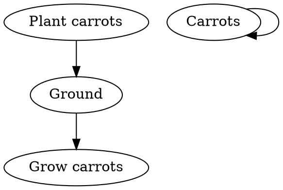

# Carrot Facts

People first grew carrots as medicine, not food, for a variety of ailments. Let's learn about carrots.

What would it be like to eat $carrots^2 * 1,000$?

--

Carrots dont have eyes which is why you rarely see them wearing sunglasses.

---

### If Carrots were programmable

```js{1-2}{numberLines: true}
const { nutrition } = carrot

try {
  eatCarrot(nutrition)
} catch (noMoreCarrots) {
  selfDestructWithoutCarrots({ reason: noMoreCarrots })
}
```

--

### Graphviz carrot chart



---

When you see a `carrot` , you can usually tell that it is a `carrot`.

$$
carrots^2 + carrots = \infty nutrition
$$

---

#### Here's a carrot


--

#### Haters gonna hate

Mel Blanc, the voice of cartoon character Bugs Bunny, reportedly did not like carrots.

Why would Disney do this to us?

---

Fin.
