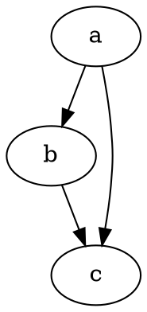

# Okay

This is test text here.

---

```js{1-2}{numberLines: true}
const a = 'hello yes hi'

try {
  something()
} catch(err) {
  somethingElse()
}
```

--

### Graphviz charts are supported



This should be inline $a^2 + b^2 = c^2$, is it?

$$
a^2 + b^2 = c^2
$$

<hr class="test" />